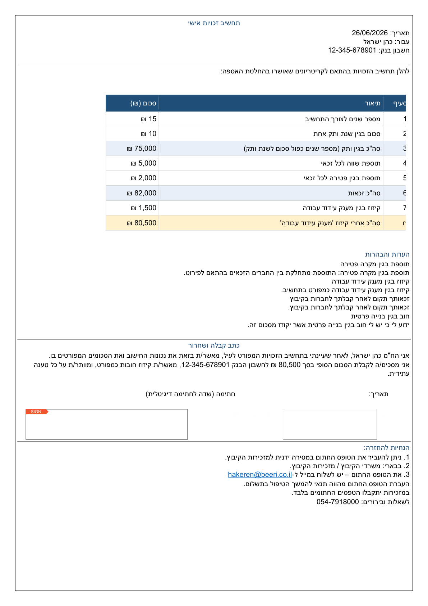

# דוח V1.2 — תיקון RTL ועמוד אחד

**תאריך:** 26/06/2026  
**סטטוס:** ממתין לאישור — **לא נבנה ZIP סופי**

---

## 1. מה גרם ליישור שמאלה

בפסקאות עברית עם `w:bidi`, Word **מהפך** את משמעות `w:jc`:
- `jc="right"` + `bidi` → מוצג ב-Word כיישור **שמאלה** (זה מה שנראה במסמך)
- `jc="left"` + `bidi` → מוצג ב-Word כיישור **ימינה** (התנהגות נכונה לעברית)

התבנית הגדירה `jc="right"` יחד עם `w:bidi`, ולכן ב-Word גוף המכתב נראה שמאלי.  
בטבלה (עם `w:bidiVisual`) ההתנהגות שונה — ולכן הטבלה נראתה יחסית תקינה.

בנוסף, `python-docx` דרס את ערך `w:jc` כשהוגדר `paragraph.alignment` — והחזיר `right` גם כשניסינו לתקן ידנית.

---

## 2. מה תוקן ב-RTL / Styles

### בתבנית (`scripts/create_template_docx.py`)

| שינוי | פירוט |
|-------|--------|
| מיפוי jc מותאם RTL | פסקאות גוף: `jc="left"` + `w:bidi` = יישור ימין ב-Word |
| הסרת דריסת jc | הוסר `paragraph.alignment = …` אחרי כתיבת OXML |
| Styles חדשים | `LG Body`, `LG Section`, `LG Notes`, `LG Receipt`, `LG Footer`, `LG Title` |
| Normal + docDefaults | `w:bidi`, `w:rtl`, שפה `he-IL`, jc ברירת מחדל לגוף RTL |
| טבלאות | ללא שינוי מיפוי — `mirror_align=False` בתאים (הטבלה נשארה תקינה) |

### ב-PDF (`src/docx_rtl_pdf.py` + `letter_generator.py`)

לפני המרה ל-PDF בלבד: `prepare_docx_for_pdf_export()` מחליף `jc="left"` → `jc="right"` בפסקאות גוף (לא בטבלאות), כי מנוע ה-PDF של Word דורש את ההפך.

**תוצאה:**
- **DOCX לעריכה** — יישור ימין נכון ב-Word
- **PDF** — יישור ימין נכון (נבדק: שול ימין ~25–37 pt לטקסט גוף)

---

## 3. מה גרם לגלישה לעמוד שני

המעבר לתבנית editable הוסיף:
- מעטפת RTL לטבלה (שורה נוספת)
- ריווחים גדולים (`after` 4–10 pt, `line_spacing` 1.15)
- גובה שורות טבלה 380 twips + padding תאים
- אזור חתימה בגובה 900 twips
- פוטר ארוך עם ריווחים לפני/אחרי

הפוטר ("לשאלות ובירורים…") נדחף לעמוד 2.

---

## 4. מה צומצם בפריסה

| פרמטר | לפני | אחרי |
|--------|------|------|
| שוליים | 1.0 ס"מ | 0.9 ס"מ |
| line spacing | 1.15 | 1.05 |
| ריווח אחרי פסקאות | 1–8 pt | 0–2 pt |
| כותרת ראשית | 22pt, after=6 | 20pt, after=2 |
| גובה שורת טבלה | 380 | 320 |
| גובה כותרת טבלה | 440 | 360 |
| padding תאים | 48–52 | 40–44 |
| אזור חתימה | 900 twips | 620 twips |
| ריווח הערות / קבלה / פוטר | גבוה | צומצם בעדינות |

**לא בוצע:** חיתוך תוכן, הקטנה קיצונית, או שינוי מבנה המכתב.

---

## 5. מספר עמודים אחרי תיקון

**1 עמוד** — דוגמה רגילה (`samples/sample_data.xlsx`) עם כל שורות הטבלה הפעילות (L, O, P).

---

## 6. נתיבי דוגמה

| קובץ | נתיב |
|------|------|
| **PDF** | `LetterGenerator\samples\pre_build_sample\12345 כהן ישראל תחשיב זכויות אישי.pdf` |
| **DOCX** | `LetterGenerator\samples\pre_build_sample\12345 כהן ישראל תחשיב זכויות אישי.docx` |
| **תבנית** | `LetterGenerator\templates\תחשיב זכויות אישי.docx` |

---

## 7. Preview

קובץ: `cursor\pre_build_sample_preview_v12_rtl.png`

---

## 8. אישור — תבנית עדיין editable

| בדיקה | תוצאה |
|-------|--------|
| `verify_editable_template.py` | עבר |
| עריכת טקסט ב-DOCX → משפיע על PDF בלי rebuild | עבר (`זכאותTEST`) |
| עריכת ריווח תא → נשמר בפלט | עבר (padding 120) |
| אין `calc_table` placeholder | אושר |
| אין הגנת קריאה בלבד | אושר |

---

## 9. אישור — לא חזרנו לבניית טבלה בקוד

| פריט | סטטוס |
|------|--------|
| `docx_table_builder.py` | לא הוחזר |
| טקסט המכתב בקוד Python | לא — רק ב-DOCX |
| JSON | טכני בלבד (מיפוי, תנאים, חתימה) |
| טבלת חישוב | מוטמעת ב-`תחשיב זכויות אישי.docx` |

---

## 10. בדיקות נוספות שעברו

- `verify_portable_design.py`
- `pre_build_sample.py` (PDF via Word + DOCX)
- שדה חתימה אינטראקטיבי (`MemberSignature`)
- שדה תאריך (`SignDateEntry`)
- טבלה מיושרת ימין (שול ימין ל"סעיף": ~29 pt)
- תנאי L/O — שורות מותנות בטבלה נשמרות

---

## קבצים ששונו

- `scripts/create_template_docx.py` — RTL, Styles, פריסה
- `src/docx_rtl_pdf.py` — **חדש** — התאמת jc ל-PDF
- `src/letter_generator.py` — קריאה לפני המרת PDF

---

## המשך

לאחר אישורך על הדוגמה ב-Word וב-PDF — ניתן להמשיך ל-build Portable.  
**ZIP סופי לא נבנה** עד לאישור מפורש.
